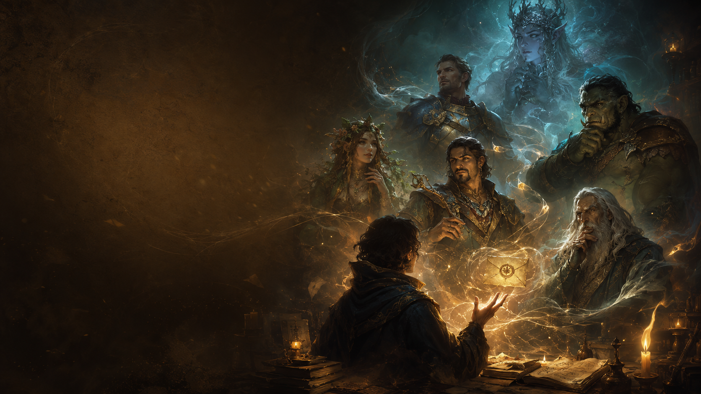
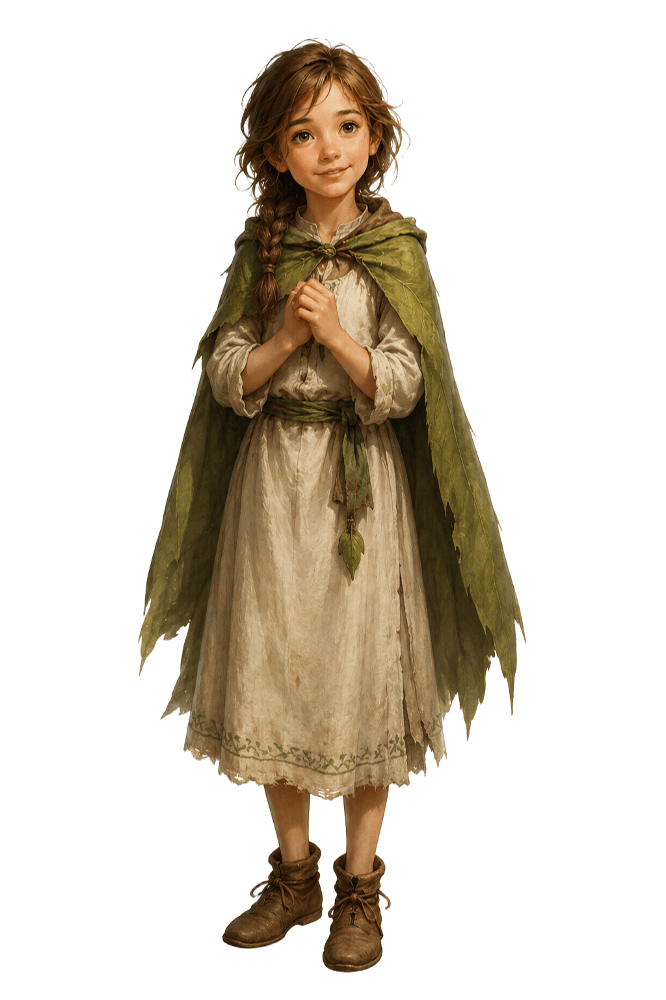
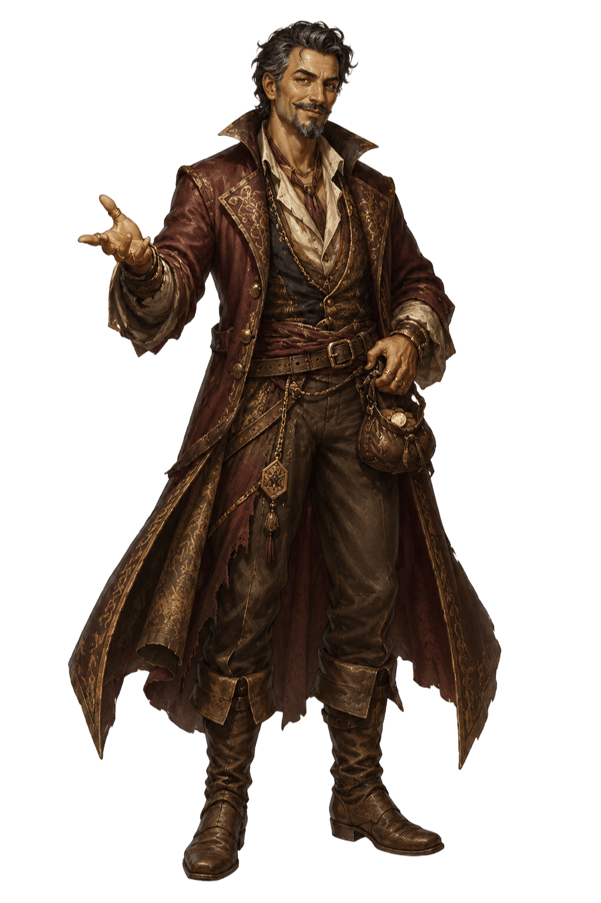
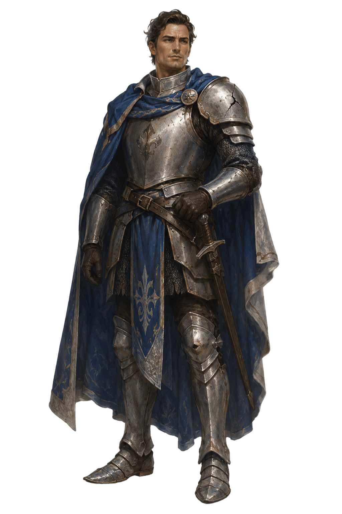
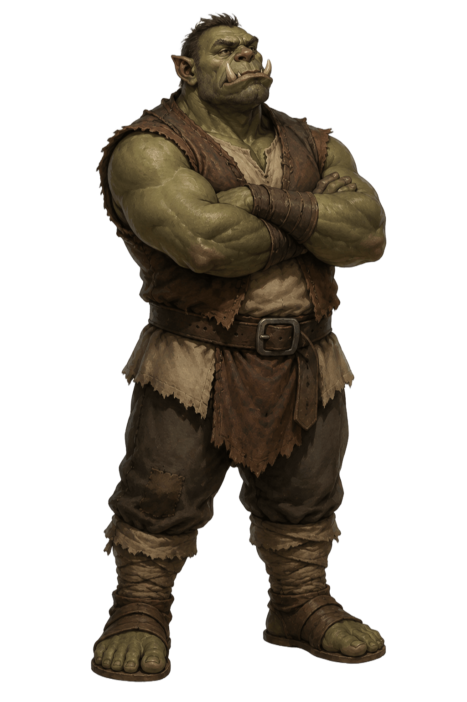
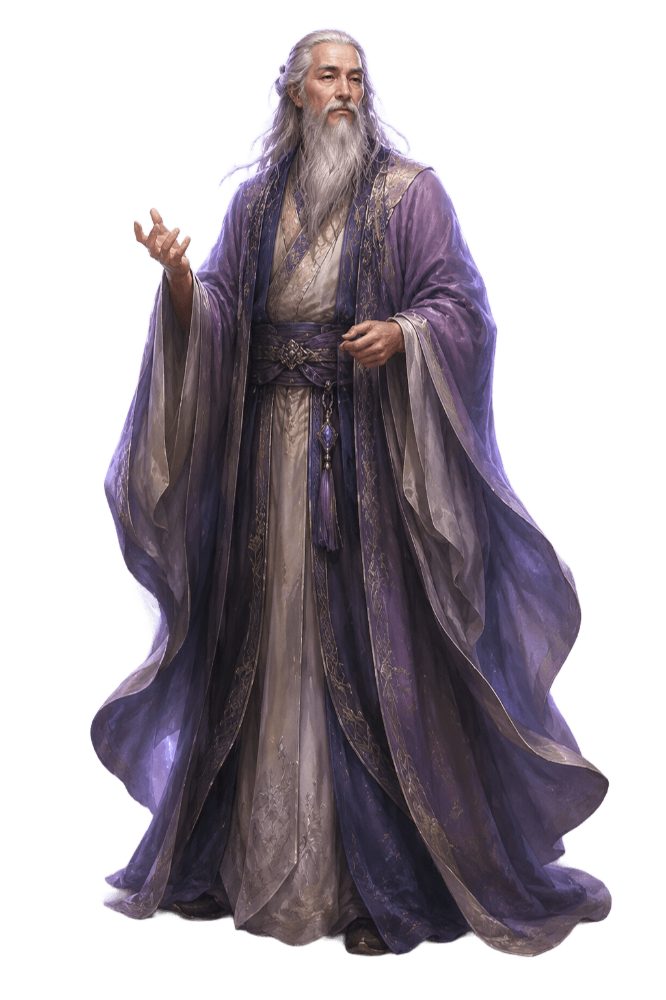
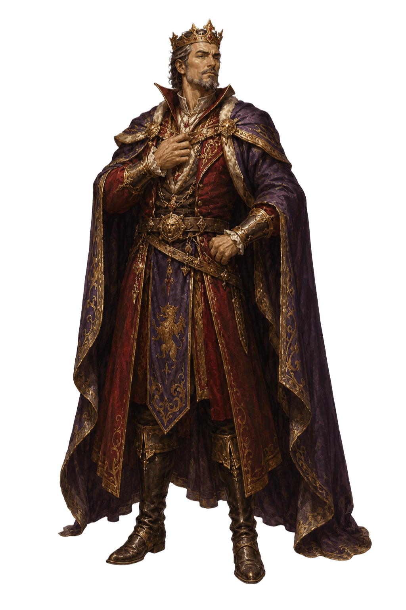
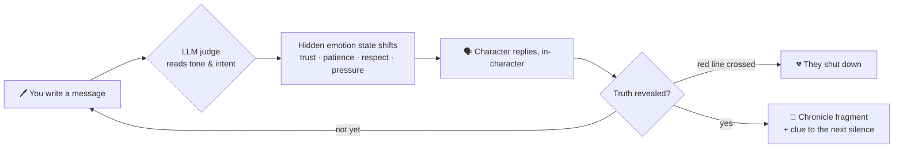
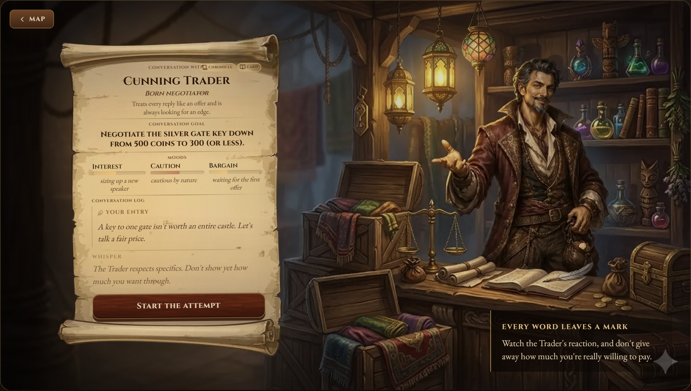
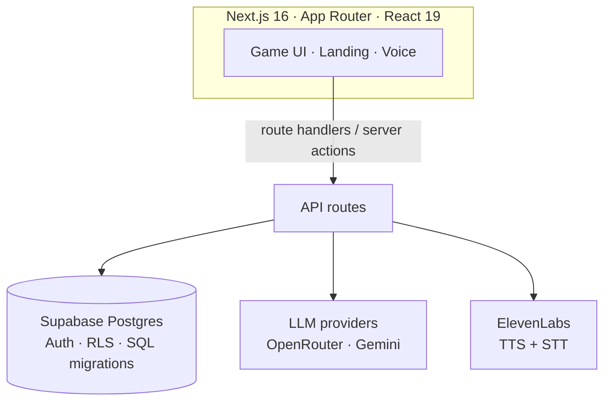

<!-- ══════════════════════════════════════════════════════════════════ -->
<!--  MindWrestle — README                                              -->
<!-- ══════════════════════════════════════════════════════════════════ -->

<p align="center">
  <a href="https://www.mindwrestle.com">
    
  </a>
</p>

<h1 align="center">MindWrestle</h1>

<p align="center">
  <strong>Convince them. Reclaim your name.</strong><br />
  <em>Seven conversations. Seven silenced truths. No swords — only words.</em>
</p>

<p align="center">
  <a href="https://www.mindwrestle.com"></a>
</p>

<p align="center">
  
  
  
  
  
  
  
</p>

---

> **A game you win by talking.** No combat, no health bars, no ready-made answers — just a conversation, and the words you choose to open a locked heart.

<p align="center">
  <a href="#-the-story">Story</a> ·
  <a href="#-meet-the-seven-silences">Characters</a> ·
  <a href="#-how-it-works">How it works</a> ·
  <a href="#-features">Features</a> ·
  <a href="#-architecture">Architecture</a> ·
  <a href="#-getting-started">Getting started</a> ·
  <a href="#-environment">Environment</a>
</p>

---

## ✦ The story

In a land that learned to stay silent, seven strangers each guard a piece of one story. Seven years ago the world cracked apart because of a single enormous lie — and everyone who knew the truth chose silence over consequence.

You are the **Nameless Wanderer**. You carry no sword. Your only tools are attention, patience, and the exact right word at the exact right moment. Every character reacts to a different approach — warmth, respect, cunning, honor, or pressure — and every message you send leaves a trace on how they see you.

Talk your way through all seven, and the truth of the **Shattered Sky** is finally spoken aloud.

## ✦ Meet the Seven Silences

<table>
  <tr>
    <td align="center" width="14%"></td>
    <td align="center" width="14%"></td>
    <td align="center" width="14%"></td>
    <td align="center" width="14%"></td>
    <td align="center" width="14%"></td>
    <td align="center" width="14%"></td>
    <td align="center" width="14%"></td>
  </tr>
  <tr>
    <td align="center"><sub><b>Child Mila</b><br/>Memory</sub></td>
    <td align="center"><sub><b>Cunning Trader</b><br/>Price</sub></td>
    <td align="center"><sub><b>Proud Knight</b><br/>Oath</sub></td>
    <td align="center"><sub><b>Stubborn Orc</b><br/>Testimony</sub></td>
    <td align="center"><sub><b>Bright Sage</b><br/>Record</sub></td>
    <td align="center"><sub><b>Magnificent King</b><br/>Command</sub></td>
    <td align="center"><sub><b>God of Silence</b><br/>Responsibility</sub></td>
  </tr>
</table>

What opens a frightened child won't move a proud knight — or a king. Each guardian protects a different truth and yields only to a different way of talking. Reveal what they're hiding to earn a fragment of the **Chronicle** and a clue leading to the next silence.

## ✦ How it works

1. **Meet the guardian of a silence** — each character has a hidden emotional state and a red line you must not cross.
2. **Listen, and choose your words** — write your own messages, watch trust, patience, and respect shift in real time, and adapt.
3. **Carry the truth forward** — when they finally speak, the Chronicle grows and the next door opens.



## ✦ Features

- 🧠 **LLM-driven characters** — every reply is generated in-character; a separate judge model reads intent and decides whether the objective was met.
- 🎭 **Hidden psychology engine** — characters track trust, patience, respect, pride, and more; cross a red line and they walk away.
- 🗺️ **Reputation & lore** — how you win echoes forward. Later characters have *heard about you*, and each victory unlocks a piece of the story.
- 🎙️ **Voice** — speak your lines and hear the characters reply (ElevenLabs TTS + STT), with server-enforced daily budgets.
- 🌍 **Fully bilingual** — English & Polish throughout, character dialogue included.
- 🕐 **Fair free model** — a pool of free attempts renews every month, tracked with atomic server-side accounting.
- ♿ **Accessible & responsive** — reduced-motion support, keyboard-friendly, mobile-ready.

## ✦ A look at the gameplay

<p align="center">
  
</p>

<p align="center"><sub>A parchment, a character portrait, and a reaction to every message you send.<br/>Here you're haggling down the price of a key — elsewhere you'll talk someone into a confession, a truce, or opening a gate.</sub></p>

## ✦ Architecture



**Stack**

| Layer | Tech |
|-------|------|
| Framework | [Next.js 16](https://nextjs.org) (App Router), React 19, TypeScript (strict) |
| Styling | [Tailwind CSS v4](https://tailwindcss.com), [Framer Motion](https://www.framer.com/motion/) |
| Data | [Supabase](https://supabase.com) — Postgres, Auth, row-level security, SQL migrations |
| AI | LLM dialogue & judging via [OpenRouter](https://openrouter.ai) / [Gemini](https://ai.google.dev) (deterministic mock fallback) |
| Voice | [ElevenLabs](https://elevenlabs.io) TTS + STT |
| Validation | [Zod](https://zod.dev) |
| Tests | [Vitest](https://vitest.dev) |

## ✦ Getting started

**Requirements:** [Bun](https://bun.sh) and a [Supabase](https://supabase.com) project (local or cloud).

```bash
# 1. Clone
git clone https://github.com/Mieszuo/MindWrestle.git
cd MindWrestle

# 2. Configure environment
cp .env.local.example .env.local
#    fill in the values (see the Environment section below)

# 3. Install & run
bun install
bun dev
```

Then open **[http://localhost:3000](http://localhost:3000)**.

> The game runs without paid AI keys — if no LLM provider is configured it falls back to a deterministic mock engine, so you can explore locally out of the box. Voice simply stays disabled until its key is set.

### Commands

| Command | Description |
|---------|-------------|
| `bun dev` | Development server |
| `bun run build` | Production build |
| `bun start` | Run the production build |
| `bun run lint` | ESLint |
| `bun test` | Tests (Vitest) |

## ✦ Project structure

```
app/            Next.js App Router — pages + API routes
components/     React components (game, landing, auth, audio, billing, ui)
lib/
  game/         Game engine — psychology, lore, reputation, risky actions
  ai/           AI integrations — in-character dialogue & judging
  billing/      Attempt wallet — monthly free attempts, atomic accounting
  i18n/         Message catalogs (en / pl) + locale resolution
  supabase/     Supabase clients + middleware
  voice/        ElevenLabs TTS + STT
hooks/          React hooks
supabase/       SQL migrations + email templates
docs/           Design docs + lore (the Chronicle lives here)
```

## ✦ Environment

Copy `.env.local.example` to `.env.local`. Below, everything that **isn't** a secret is filled in with sensible defaults — you only need to supply your own **keys and URLs** (the `your-…` placeholders).

```bash
# ── Supabase ───────────────────────────────────────────────
NEXT_PUBLIC_SUPABASE_URL=https://your-project.supabase.co
NEXT_PUBLIC_SUPABASE_ANON_KEY=your-anon-or-publishable-key
SUPABASE_SERVICE_ROLE_KEY=your-service-role-key        # server only

# ── App ────────────────────────────────────────────────────
NEXT_PUBLIC_SITE_URL=http://localhost:3000             # https://www.mindwrestle.com in prod
AUTH_REQUIRED=false                                    # true in prod (requires login to play)

# ── AI providers (server only) ─────────────────────────────
# If none are set, the engine falls back to a deterministic mock — great for local dev.
OPENROUTER_API_KEY=your-openrouter-api-key
OPENROUTER_JUDGE_MODEL=openai/gpt-4o-mini
OPENROUTER_CHARACTER_MODEL=anthropic/claude-3.5-haiku
OPENROUTER_SITE_URL=http://localhost:3000
# Optional native providers (used instead of OpenRouter when set):
GEMINI_API_KEY=your-gemini-api-key
GEMINI_MODEL=gemini-2.5-flash
DEEPSEEK_API_KEY=your-deepseek-api-key

# ── Psychology engine ──────────────────────────────────────
PSYCH_ENGINE_ENABLED=true      # layered persuasion (recommended); false = legacy engine
PSYCH_INNER_MONOLOGUE=false    # include the characters' internal debate in LLM output

# ── Voice (ElevenLabs) ─────────────────────────────────────
ELEVENLABS_API_KEY=your-elevenlabs-api-key             # voice stays off until set
TTS_DAILY_CHAR_LIMIT=40000                             # per-user, per UTC day
STT_DAILY_REQUEST_LIMIT=200

# ── Freemium limits ────────────────────────────────────────
FREE_ATTEMPTS_PER_MONTH=3
MAX_USER_MESSAGES_PER_ATTEMPT=25

# ── Admin panel (/admin) ───────────────────────────────────
ADMIN_EMAIL=your-admin@email.com                       # comma-separated emails
```

> 🔒 **Never commit real secrets.** `.env.local` is git-ignored; keys shown as `your-…` above are placeholders only.

---

<p align="center">
  <a href="https://www.mindwrestle.com"></a>
</p>

<p align="center"><sub>A game you win by talking. · Seven silences await.</sub></p>
